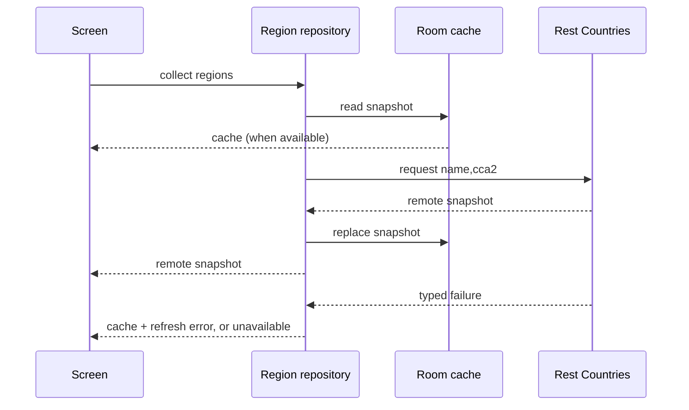
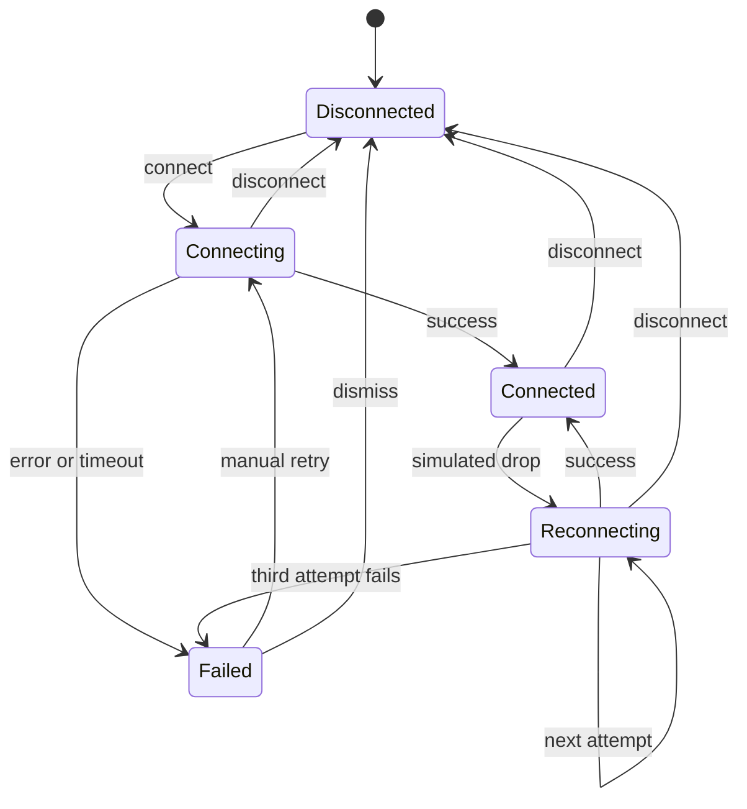
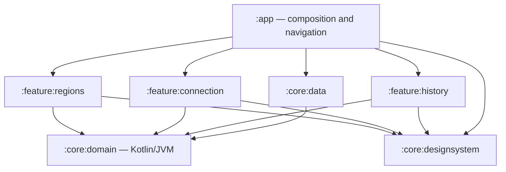

# NetLens

**PT:** NetLens é um app Android educativo para observar conectividade, executar diagnósticos em camadas e explicar falhas de uma conexão simulada. O projeto tem exatamente três telas planejadas: **Lista de regiões**, **Detalhe da conexão** e **Histórico de eventos**. A Lista de regiões seleciona o destino; o Detalhe da conexão mostra o estado da sessão, a conectividade do sistema e os resultados de DNS, TLS e HTTPS; o Histórico de eventos mostra as transições persistidas localmente.

**EN:** NetLens is an educational Android app for observing connectivity, running layered diagnostics, and explaining failures in a simulated connection. The project has exactly three planned screens: **Region List**, **Connection Detail**, and **Event History**. Region List selects the destination; Connection Detail shows the session state, system connectivity snapshot, and DNS, TLS, and HTTPS results; Event History shows locally persisted transitions.

## Estado do projeto / Project status

**PT:** Este estágio implementa os contratos de domínio, o cache offline-first em Room v1, a fonte REST real do Rest Countries, a persistência de eventos e a base de diagnóstico de conectividade. O trabalho de rede de produção usa APIs Android e operações reais de DNS, TLS e HTTPS. Os testes JVM injetam operações de baixo nível determinísticas, portanto não acessam a rede nem exigem um runtime Android. A UI completa e as ViewModels pertencem a uma etapa posterior; os contratos já deixam a Lista de regiões, o Detalhe da conexão e o Histórico de eventos isolados das implementações.

**EN:** This stage implements the domain contracts, an offline-first Room v1 cache, the real Rest Countries REST source, event persistence, and the connectivity diagnostics foundation. Production network work uses Android APIs and real DNS, TLS, and HTTPS operations. JVM tests inject deterministic low-level operations, so they use neither the network nor an Android runtime. The complete UI and ViewModels belong to a later stage; the contracts already keep Region List, Connection Detail, and Event History separate from implementations.

**PT:** O aplicativo solicita apenas `INTERNET` e `ACCESS_NETWORK_STATE`. Ele não cria VPN, túnel, conexão peer-to-peer, gateway de sockets, interface TUN, NAT ou roteamento de tráfego de produção. NetLens explicitamente **não é uma VPN de produção**.

**EN:** The application requests only `INTERNET` and `ACCESS_NETWORK_STATE`. It does not create a VPN, tunnel, peer-to-peer link, socket gateway, TUN interface, NAT, or production traffic router. NetLens is explicitly **not a production VPN**.

## Fluxo offline-first / Offline-first flow



**PT:** Cada coleta lê o cache primeiro. Uma atualização remota bem-sucedida substitui o snapshot de forma transacional. Se a atualização falhar, os dados do cache continuam disponíveis e a falha vira um tipo seguro (`NetworkUnavailable`, `DnsResolution`, `Tls`, `Http`, `Timeout` ou `Unknown`). Quando não há cache, a tela recebe `Unavailable`; uma nova coleta ou `retry()` executa a tentativa novamente. `name` e `cca2` são os únicos campos solicitados ao Rest Countries.

**EN:** Each collection reads the cache first. A successful remote refresh replaces the snapshot transactionally. If refresh fails, cached data stays available and the failure becomes a safe typed value (`NetworkUnavailable`, `DnsResolution`, `Tls`, `Http`, `Timeout`, or `Unknown`). Without a cache, the screen receives `Unavailable`; a new collection or `retry()` starts the attempt again. `name` and `cca2` are the only fields requested from Rest Countries.

**PT:** A API não fornece uma latência medida para uma região. `simulatedLatency` é derivada localmente e de forma determinística do código e do nome normalizados da região, usando um hash limitado. É um valor didático da simulação de conexão, não uma medição da rede do usuário nem da distância até o país remoto.

**EN:** The API does not provide a measured latency for a region. `simulatedLatency` is derived locally and deterministically from the normalized region code and name with a bounded hash. It is a teaching value for the connection simulation, not a measurement of the user's network or the remote country's distance.

## Diagnóstico real / Real diagnostics

**PT:** A base de diagnóstico tem três probes independentes:

1. **DNS** resolve o host de destino dentro de um timeout nomeado.
2. **TLS** abre um socket e conclui a negociação com validação de certificado dentro de um timeout nomeado.
3. **HTTPS** executa uma requisição `HEAD` limitada e registra somente o status e o tempo decorrido medido localmente.

**EN:** The diagnostics foundation has three independent probes:

1. **DNS** resolves the target host with a named timeout.
2. **TLS** opens a socket and completes certificate-validated negotiation with a named timeout.
3. **HTTPS** performs a bounded `HEAD` request and records only the status code and locally measured elapsed time.

**PT:** `ConnectivityManager` fornece um snapshot inicial e atualizações por callback através de `NetworkCallback`. `NetworkCapabilities` informa disponibilidade, validação e transportes como Wi-Fi, celular, Ethernet, VPN e Bluetooth. O adapter remove o callback exato quando a coleta termina. Os probes verificam o snapshot injetado antes de iniciar I/O e classificam falhas em tipos de domínio sem vazar o texto da exceção.

**EN:** `ConnectivityManager` supplies an initial snapshot and callback updates through `NetworkCallback`. `NetworkCapabilities` reports availability, validation, and transports such as Wi-Fi, cellular, Ethernet, VPN, and Bluetooth. The adapter unregisters the exact callback when collection ends. The probes check the injected snapshot before starting I/O and classify failures into domain types without leaking exception text.

**PT:** Diagnóstico real significa que os adaptadores de produção consultam o Android e executam essas operações contra o alvo configurado. Falhas simuladas da máquina de conexão são outra camada: os testes injetam `ConnectionAttemptDriver`, `DnsResolver`, `TlsConnector` e `HttpsRequester` para reproduzir sucesso, DNS, TLS, HTTP, timeout e indisponibilidade sem depender de rede real. Assim, uma falha reproduzida em teste não é apresentada como uma medição do dispositivo.

**EN:** Real diagnostics means production adapters query Android and run these operations against the configured target. Simulated connection-machine failures are a separate layer: tests inject `ConnectionAttemptDriver`, `DnsResolver`, `TlsConnector`, and `HttpsRequester` to reproduce success, DNS, TLS, HTTP, timeout, and unavailable cases without depending on a real network. A reproduced test failure is therefore never presented as a device measurement.

## Privacidade / Privacy

**PT:** Os probes não registram payloads, credenciais, cabeçalhos ou conteúdo de tráfego. O probe HTTPS não lê o corpo da resposta. A camada de domínio expõe somente a camada testada, latência local, status HTTP quando aplicável e categorias tipadas de erro. O histórico Room armazena transições da sessão e valores de região necessários à explicação; não armazena conteúdo de rede.

**EN:** Probes do not log payloads, credentials, headers, or traffic content. The HTTPS probe never reads the response body. The domain layer exposes only the tested layer, local elapsed time, an HTTP status when applicable, and typed error categories. Room history stores session transitions and the region values needed to explain them; it does not store network content.

## Máquina de estados / State machine



**PT:** Os estados são tipos selados com dados associados: região em `Connecting`; região e timestamp em `Connected`; região, número da tentativa e motivo da queda em `Reconnecting`; motivo tipado em `Failed` (`NetworkError`, `Timeout`, `ServerUnavailable` ou `Unknown`). Cada tentativa tem orçamento de cinco segundos. Após uma queda, há no máximo três tentativas automáticas, precedidas por esperas de **1 s, 2 s e 4 s**. Essas esperas não incluem o tempo gasto tentando conectar. Um retry manual inicia uma nova conexão; não é uma quarta tentativa automática.

**EN:** States are sealed types carrying their relevant data: the region in `Connecting`; region and timestamp in `Connected`; region, attempt number, and drop reason in `Reconnecting`; and a typed reason in `Failed` (`NetworkError`, `Timeout`, `ServerUnavailable`, or `Unknown`). Each attempt has a five-second budget. A drop triggers at most three automatic attempts, preceded by **1 s, 2 s, and 4 s** delays. These delays exclude connection-attempt time. A manual retry starts a fresh connection; it is not a fourth automatic attempt.

## Arquitetura / Architecture



**PT:** `core:domain` é Kotlin/JVM e não importa Android. Ele define estados, repositórios, resultados e erros tipados. `core:data` adapta Room, Retrofit, `ConnectivityManager` e as operações de rede aos contratos. O código de baixo nível é injetável, o que mantém os testes da JVM isolados. O app compõe o grafo; as features futuras terão MVVM e Compose observando `StateFlow`.

**EN:** `core:domain` is Kotlin/JVM and imports no Android APIs. It defines states, repositories, results, and typed failures. `core:data` adapts Room, Retrofit, `ConnectivityManager`, and network operations to those contracts. Low-level work is injectable, which keeps JVM tests isolated. The app composes the graph; future features will use MVVM with Compose observing `StateFlow`.

## Decisões técnicas / Technical decisions

### Estado, tempo e falhas / State, time, and failures

**PT:** A conexão é uma sessão com trabalho cancelável. Desconectar invalida uma tentativa antiga antes de cancelá-la, impedindo que ela publique `Connected` depois da ação do usuário. Relógio, driver de conexão, probes e operações de I/O são dependências substituíveis; a produção executa diagnóstico real e a simulação continua reproduzível nos testes. Eventos são registros escalares e persistidos com um identificador de armazenamento próprio, separado do contador local do motor.

**EN:** A connection is a cancellable session. Disconnect invalidates an old attempt before cancelling it, preventing it from publishing `Connected` after the user's action. The clock, connection driver, probes, and I/O operations are replaceable dependencies; production runs real diagnostics while the simulation stays reproducible in tests. Events are scalar records persisted with their own storage identifier, separate from the engine's local counter.

### Dados offline / Offline data

**PT:** Room mantém a última lista de regiões e o histórico de eventos. Retrofit solicita apenas `name` e `cca2` ao Rest Countries. O repositório lê o snapshot local antes do refresh remoto, substitui a lista somente após sucesso e preserva o cache quando a atualização falha.

**EN:** Room keeps the latest region list and event history. Retrofit requests only `name` and `cca2` from Rest Countries. The repository reads the local snapshot before remote refresh, replaces the list only after success, and preserves the cache when refresh fails.

### Stack e build / Stack and build

| Escolha / Choice | Motivo / Rationale |
| --- | --- |
| Kotlin + `core:domain` Kotlin/JVM | Tipos selados e contratos testáveis sem Android / Sealed types and contracts testable without Android. |
| Compose + Material 3 | UI declarativa para as três telas / Declarative UI for the three screens. |
| Coroutines + Flow/StateFlow | Cancelamento estruturado e observação reativa / Structured cancellation and reactive observation. |
| Room + KSP | Cache local, histórico e schema versionado / Local cache, history, and versioned schema. |
| Retrofit + kotlinx.serialization | Fronteira REST tipada com campos mínimos / Typed REST boundary with minimal fields. |
| `ConnectivityManager` + `NetworkCapabilities` | Estado do sistema e transportes Android / Android system state and transports. |
| JUnit + kotlinx-coroutines-test | Falhas reproduzíveis sem rede e sem `Thread.sleep()` / Reproducible failures without network or `Thread.sleep()`. |

**PT:** O catálogo fixa AGP 9.1.0, Kotlin 2.2.10, Gradle 9.3.1, JDK 21, `minSdk 26` e compile/target SDK 36. Room exporta o schema v1 para que mudanças futuras usem migrações explícitas. O app não inclui bibliotecas de túnel ou VPN porque esse comportamento está fora do produto.

**EN:** The catalog pins AGP 9.1.0, Kotlin 2.2.10, Gradle 9.3.1, JDK 21, `minSdk 26`, and compile/target SDK 36. Room exports the v1 schema so future changes use explicit migrations. The app includes no tunnel or VPN libraries because that behavior is outside the product.

## Depuração e reprodução / Debugging and reproduction

**PT:** Para reproduzir um resultado de diagnóstico, use um alvo HTTPS controlado e observe a sequência DNS → TLS → HTTPS. O primeiro erro tipado identifica a camada que falhou; um status HTTP separa falha de aplicação de falha de transporte. Para reproduzir sem variar a rede, substitua os adapters injetados por fakes: retorne uma lista de endereços, lance `UnknownHostException`, retorne um status como `503` ou suspenda até o timeout. Para testar o cache, faça o primeiro refresh falhar, colete novamente e verifique que o snapshot local aparece antes da nova tentativa.

**EN:** To reproduce a diagnostic result, use a controlled HTTPS target and inspect the DNS → TLS → HTTPS sequence. The first typed failure identifies the layer that failed; an HTTP status separates an application response from a transport failure. To reproduce without network variability, replace the injected adapters with fakes: return addresses, throw `UnknownHostException`, return a status such as `503`, or suspend until the timeout. To test caching, fail the first refresh, collect again, and verify that the local snapshot appears before the next attempt.

**PT:** Nenhum teste usa `Thread.sleep()`. O tempo virtual das coroutines e os relógios injetados tornam determinísticas as asserções de timeout, backoff e latência.

**EN:** No test uses `Thread.sleep()`. Coroutine virtual time and injected clocks make timeout, backoff, and latency assertions deterministic.

## A decisão de teste mais importante / The most important testing decision

**PT:** O cenário crítico é uma queda seguida de recuperação: um teste precisa provar o número permitido de tentativas, os intervalos de 1/2/4 segundos e o cancelamento durante o backoff. Verificar somente o estado final poderia esconder uma quarta tentativa ou uma reconexão publicada depois de desconectar. Para a camada de dados, os testes verificam cache antes do remoto, falha com cache preservado, falha sem cache e retry. Para diagnóstico, cada classificação é exercitada por adapters injetados, sem depender da rede.

**EN:** The critical scenario is a drop followed by recovery: a test must prove the allowed attempt count, the 1/2/4-second intervals, and cancellation during backoff. Checking only the final state could hide a fourth attempt or a reconnection published after disconnect. For data, tests verify cache before remote, failure with cache preserved, failure without cache, and retry. For diagnostics, each classification is exercised through injected adapters without depending on the network.

## Limitações / Limitations

**PT:** `NET_CAPABILITY_VALIDATED` é uma indicação do Android, não uma garantia de que todos os destinos estejam acessíveis. Firewalls, captive portals, DNS privado, certificados, proxies e políticas de rede podem produzir resultados diferentes. O probe HTTPS usa `HEAD`, e alguns servidores podem rejeitar esse método; isso é reportado como status HTTP. A resolução DNS usa uma operação interruptível em I/O e tem timeout do probe, mas o resolvedor do sistema operacional pode continuar trabalhando por algum tempo depois do cancelamento; o app não interpreta essa limitação como uma medição precisa. As operações bloqueantes de socket e HTTPS também recebem limites nativos. A lista pública depende da disponibilidade e do contrato atual do Rest Countries.

**EN:** `NET_CAPABILITY_VALIDATED` is an Android indication, not a guarantee that every destination is reachable. Firewalls, captive portals, private DNS, certificates, proxies, and network policies can produce different results. The HTTPS probe uses `HEAD`, and some servers may reject that method; the status is reported as HTTP. DNS resolution uses an interruptible I/O operation and a probe timeout, but the operating system resolver may continue working briefly after cancellation; the app does not present that limitation as a precise measurement. Socket and HTTPS operations also have native time limits. The public list depends on Rest Countries availability and its current contract.

## Execução local / Running locally

**PT:** Instale JDK 21 e Android SDK API 36. Abra a raiz no Android Studio e aguarde a sincronização. Configure `sdk.dir` em `local.properties` ou `ANDROID_HOME`; `local.properties` não é versionado. Selecione `app` e um emulador API 26 ou superior.

**EN:** Install JDK 21 and Android SDK API 36. Open the root in Android Studio and wait for sync. Configure `sdk.dir` in `local.properties` or `ANDROID_HOME`; `local.properties` is not tracked. Select `app` and an API 26+ emulator.

```bash
./gradlew test
./gradlew ktlintCheck
./gradlew lint
./gradlew :app:assembleDebug
```

**PT:** Os testes de domínio, dados e diagnóstico rodam na JVM; não precisam de emulador nem de uma rede disponível. Testes instrumentados de UI serão adicionados quando as três telas forem implementadas.

**EN:** Domain, data, and diagnostics tests run on the JVM; they need neither an emulator nor an available network. UI instrumentation tests will be added when the three screens are implemented.

## Testes e qualidade / Tests and quality

**PT:** A suíte JVM cobre a máquina de estados, o fluxo offline-first, o armazenamento e mapeamento de eventos, a classificação DNS/TLS/HTTP/timeout/indisponibilidade e o cálculo determinístico de latência. O lint também valida o adapter Android e o schema Room gerado durante o build.

**EN:** The JVM suite covers the state machine, the offline-first flow, event storage and mapping, DNS/TLS/HTTP/timeout/unavailable classification, and deterministic latency calculation. Lint also validates the Android adapter and the Room schema generated during the build.

```bash
./gradlew connectedAndroidTest
```

**PT:** `connectedAndroidTest` exige um emulador ou dispositivo conectado e será relevante para os fluxos visuais quando as três telas forem implementadas. Uma tarefa sem fontes de teste de UI não representa cobertura de uma tela.

**EN:** `connectedAndroidTest` requires a connected emulator or device and will become relevant to visual flows when the three screens are implemented. A task without UI test sources does not represent screen coverage.

## O que eu faria diferente com mais tempo / What I would do differently with more time

**PT:** Eu acrescentaria testes instrumentados para recriação de processo e estados offline, configuração de alvo local dentro do Detalhe da conexão para reprodução controlada e observabilidade agregada sem conteúdo de tráfego. Também avaliaria paginação caso a fonte pública crescesse. Esses itens são possibilidades futuras, não funcionalidades deste escopo.

**EN:** I would add instrumentation tests for process recreation and offline states, local-target configuration inside Connection Detail for controlled reproduction, and aggregate observability without traffic content. I would also evaluate pagination if the public source grew. These are future possibilities, not features in this scope.

## Screenshots

**PT:** Screenshots ou um GIF das três telas serão adicionados quando a UI for implementada.

**EN:** Screenshots or a short GIF of the three screens will be added when the UI is implemented.
