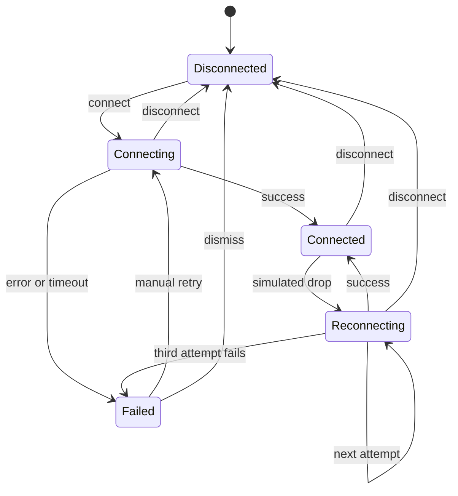
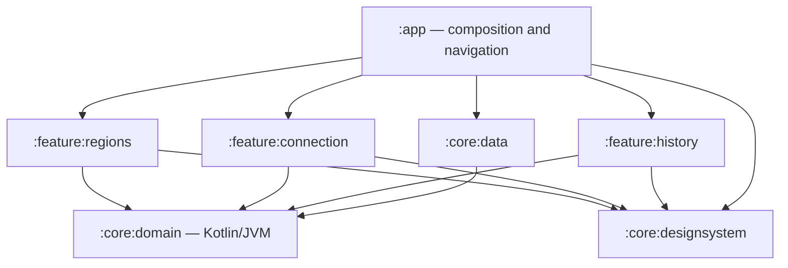

# NetLens

**PT:** NetLens ajuda a entender o estado de uma conexão simulada e o que acontece quando ela falha ou tenta se recuperar.

**EN:** NetLens helps users understand a simulated connection's state and what happens when it fails or tries to recover.

## Estado do projeto / Project status

**PT:** Implementação incremental de um app Android de diagnóstico de conexão. Esta etapa contém a estrutura multi-módulo, os contratos de domínio e a máquina de estados com testes unitários. O host Android ainda abre um destino vazio; as três telas, a integração REST, o cache Room e os testes de UI serão implementados nas próximas etapas. Não estabelece uma VPN real.

**EN:** An Android connection diagnostics app built incrementally. This stage contains the multi-module foundation, domain contracts, and a state machine with unit tests. The Android host still opens an empty destination; the three screens, REST integration, Room cache, and UI tests will be implemented in later stages. It does not establish a real VPN.

## Máquina de estados / State machine



**PT:** Os estados são tipos selados com dados associados: região em `Connecting`; região e timestamp em `Connected`; região, número da tentativa e motivo da queda em `Reconnecting`; motivo tipado em `Failed` (`NetworkError`, `Timeout`, `ServerUnavailable` ou `Unknown`). Cada tentativa tem um orçamento de cinco segundos. Após uma queda, há no máximo três tentativas automáticas, precedidas por esperas de **1 s, 2 s e 4 s**. Essas esperas não incluem o tempo gasto tentando conectar. Um retry manual inicia uma nova conexão; não é uma quarta tentativa automática.

**EN:** States are sealed types carrying their relevant data: the region in `Connecting`; region and timestamp in `Connected`; region, attempt number, and drop reason in `Reconnecting`; and a typed reason in `Failed` (`NetworkError`, `Timeout`, `ServerUnavailable`, or `Unknown`). Each attempt has a five-second budget. A drop triggers at most three automatic attempts, preceded by delays of **1 s, 2 s, and 4 s**. These delays exclude the time spent attempting to connect. A manual retry starts a fresh connection; it is not a fourth automatic attempt.

## Arquitetura / Architecture



**PT:** Os módulos Gradle tornam a direção das dependências explícita. `core:domain` não usa o framework Android: contém modelos, contratos e Use Cases. A máquina vive no pacote de domínio de `feature:connection`, também sem imports Android, e implementa o contrato do motor definido no domínio compartilhado. Isso permite que o futuro repositório em `core:data` receba o motor por interface, sem uma dependência circular entre dados e feature. O app compõe o grafo; as features terão MVVM, com Compose observando `StateFlow` e ViewModels chamando Use Cases.

**EN:** Gradle modules make dependency direction explicit. `core:domain` does not use the Android framework: it contains models, contracts, and use cases. The machine lives in the domain package of `feature:connection`, also without Android imports, and implements the engine contract defined in the shared domain. This lets the future repository in `core:data` receive the engine through an interface without a circular dependency between data and feature modules. The app composes the graph; features will use MVVM, with Compose observing `StateFlow` and ViewModels calling use cases.

## Decisões técnicas / Technical decisions

### Estado, tempo e falhas / State, time, and failures

**PT:** A conexão é uma sessão com trabalho cancelável. Desconectar deve impedir que uma tentativa antiga publique `Connected` depois da ação do usuário. Relógio, execução de coroutines e aleatoriedade são dependências substituíveis: a produção pode simular instabilidade, enquanto os testes controlam precisamente a ordem dos acontecimentos. Os eventos da sessão são retidos mesmo quando não há uma tela coletando o fluxo; a persistência em Room será adicionada na camada de dados.

**EN:** A connection is a session with cancellable work. Disconnecting must prevent an old attempt from publishing `Connected` after the user's action. The clock, coroutine execution, and randomness are replaceable dependencies: production can simulate instability while tests precisely control event order. Session events are retained even when no screen is collecting the flow; Room persistence will be added in the data layer.

### Reconexão e testes / Reconnection and testing

**PT:** O backoff de 1/2/4 segundos aumenta gradualmente o intervalo entre tentativas e limita a espera deste diagnóstico simulado. Os valores são constantes nomeadas, não números espalhados pela lógica. Turbine permite verificar a sequência de emissões do Flow, incluindo estados intermediários; `kotlinx-coroutines-test` controla o tempo sem `Thread.sleep()`. MockK isola os Use Cases dos repositórios.

**EN:** The 1/2/4-second backoff gradually spaces attempts apart and bounds the wait in this simulated diagnostic tool. Values are named constants rather than scattered numbers. Turbine checks the sequence of Flow emissions, including intermediate states; `kotlinx-coroutines-test` controls time without `Thread.sleep()`. MockK isolates use cases from repository implementations.

### Dados offline / Offline data

**PT:** A estratégia escolhida para a próxima etapa é offline-first: emitir cache antes de consultar a API e conservar dados utilizáveis quando a rede falhar. Room armazenará regiões e eventos; Retrofit com kotlinx.serialization fará a integração REST real. Essa integração ainda não está implementada neste commit.

**EN:** The strategy selected for the next stage is offline-first: emit cached data before contacting the API and preserve usable data when the network fails. Room will store regions and events; Retrofit with kotlinx.serialization will handle the real REST integration. This integration is not implemented in this commit yet.

### Stack e build / Stack and build

| Escolha / Choice | Motivo / Rationale |
| --- | --- |
| Kotlin | Tipos selados expressam estados e erros / Sealed types express states and errors. |
| Compose + Material 3 | UI declarativa e componentes consistentes / Declarative UI and consistent components. |
| Hilt + KSP | Composição por DI e processamento de anotações / DI composition and annotation processing. |
| Coroutines + Flow/StateFlow | Cancelamento estruturado e observação reativa / Structured cancellation and reactive observation. |
| Navigation Compose | Navegação limitada às três telas previstas / Navigation limited to the three planned screens. |
| Room + Retrofit + kotlinx.serialization | Persistência local e fronteira REST tipada / Local persistence and a typed REST boundary. |
| ktlint | Estilo consistente; plugin 14.2 reconhece Kotlin integrado ao AGP 9 / Consistent style; plugin 14.2 recognizes AGP 9's built-in Kotlin. |

**PT:** Gradle 9.3.1 e AGP 9.1.0 estão fixados, com checksum do wrapper; o catálogo centraliza versões. JDK 21 executa o build e define o alvo JVM. `minSdk 26` limita o custo de compatibilidade legada; compile/target SDK são 36. Coil só será incluído se a UI precisar de imagens. O CI atual valida a configuração dos módulos; a execução completa de testes e lint no GitHub Actions será conectada na etapa de CI.

**EN:** Gradle 9.3.1 and AGP 9.1.0 are pinned, with a wrapper checksum; the catalog centralizes versions. JDK 21 runs the build and defines the JVM target. `minSdk 26` limits legacy compatibility work; compile/target SDK are 36. Coil will only be included if the UI needs images. Current CI validates module configuration; the complete GitHub Actions test and lint pipeline will be connected during the CI stage.

## A decisão de teste mais importante / The most important testing decision

**PT:** O cenário mais crítico é a recuperação após uma queda: não basta terminar em `Failed` ou `Connected`. O teste precisa provar que houve exatamente as tentativas permitidas, nos intervalos corretos, e que desconectar durante uma espera impede tentativas posteriores. Verificar apenas o estado final poderia esconder uma quarta tentativa ou uma reconexão tardia. Os testes observam estados com Turbine e avançam o relógio virtual nas fronteiras do timeout e do backoff.

**EN:** The most critical scenario is recovery after a drop: ending in `Failed` or `Connected` is not enough. Tests must prove that exactly the allowed attempts occurred at the correct intervals and that disconnecting during a wait prevents later attempts. Checking only the final state could hide a fourth attempt or a late reconnection. Tests observe states with Turbine and advance virtual time across timeout and backoff boundaries.

## Execução local / Running locally

**PT:** Instale JDK 21 e Android SDK API 36. Abra a raiz do projeto no Android Studio e aguarde a sincronização do Gradle. Configure o caminho do SDK em `local.properties` (`sdk.dir=...`) ou na variável `ANDROID_HOME`; `local.properties` não é versionado. Selecione a configuração `app` e um emulador com API 26 ou superior — por exemplo, `Medium_Phone_API_36.1` — e clique em Run. Não é necessário um celular físico. O destino vazio é esperado nesta etapa.

**EN:** Install JDK 21 and Android SDK API 36. Open the project root in Android Studio and wait for Gradle sync. Configure the SDK path in `local.properties` (`sdk.dir=...`) or the `ANDROID_HOME` environment variable; `local.properties` is not tracked. Select the `app` configuration and an API 26+ emulator — for example, `Medium_Phone_API_36.1` — and click Run. No physical phone is required. The empty destination is expected at this stage.

```bash
./gradlew projects
./gradlew :app:assembleDebug
```

## Testes e qualidade / Tests and quality

```bash
./gradlew test
./gradlew ktlintCheck
./gradlew lint
```

**PT:** Os testes unitários de domínio e da máquina rodam na JVM, sem emulador. Os testes de UI ainda não foram implementados; quando estiverem disponíveis, execute o comando abaixo com um emulador ou dispositivo conectado. Não interprete uma tarefa sem fontes de teste como cobertura de um fluxo de UI.

**EN:** Domain and state-machine unit tests run on the JVM without an emulator. UI tests have not been implemented yet; once available, run the following command with an emulator or device connected. A task without test sources does not mean a UI flow is covered.

```bash
./gradlew connectedAndroidTest
```

## O que eu faria diferente com mais tempo / What I would do differently with more time

**PT:** Após concluir o escopo, ampliaria testes de instrumentação para recriação de processos e cenários offline, mediria o comportamento com observabilidade real e avaliaria paginação caso o volume de regiões justificasse. Esses itens são possibilidades futuras, não funcionalidades implementadas nem expansão do escopo atual.

**EN:** After completing the scope, I would expand instrumentation tests to cover process recreation and offline scenarios, measure behavior with real observability, and consider pagination if region volume justified it. These are future possibilities, not implemented features or additions to the current scope.

## Screenshots

**PT:** Screenshots ou GIF do app serão adicionados após a implementação das telas.

**EN:** Screenshots or a short app GIF will be added after the screens are implemented.
